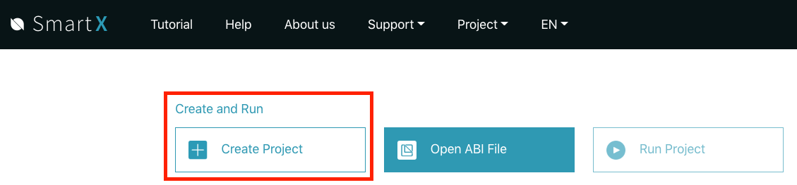
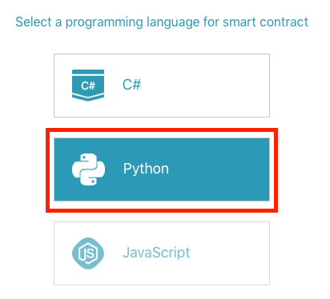
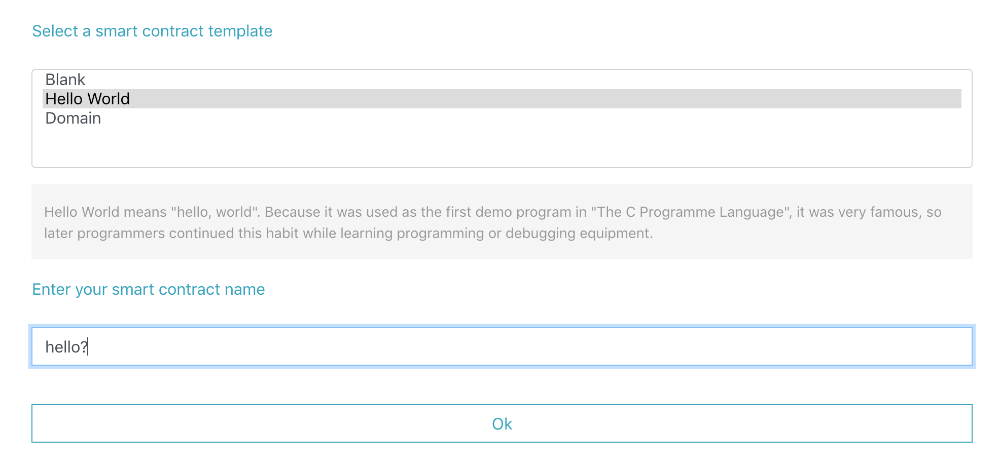
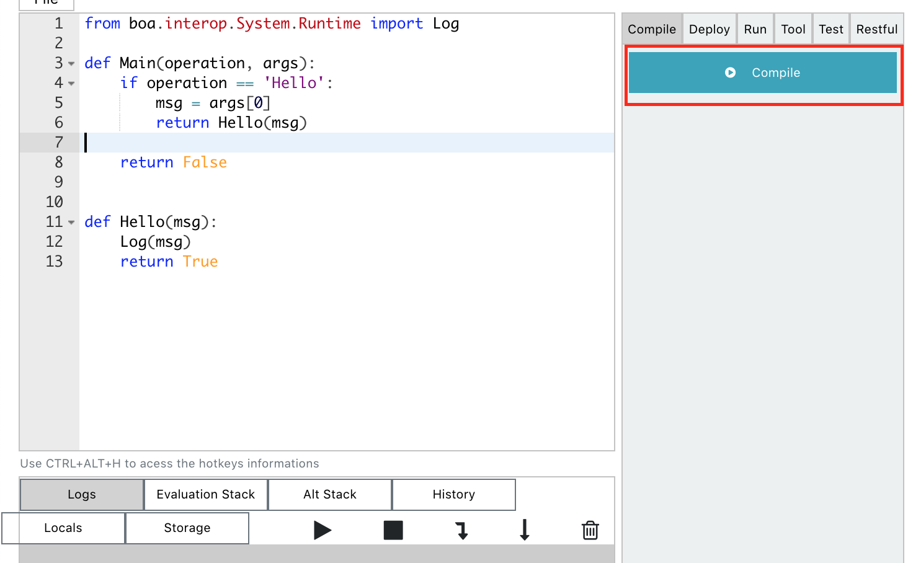

# Getting started
This is a walkthrough of how to get setup in order to start creating, deploying, and interacting with smart contracts on the Ontology Blockchain.

We will be using 3 separate tools during development:

##### SmartX
Write and compile smart contract code. Templates are available to start.

##### Solo Chain
A self contained Ontology private network. No additional dependencies required.

##### O3
dAPI wallet provider which supports the Ontology interface

## Installation
Download and install the latest version of the latest versions of the Solo Chain and O3 applications

[Solo Chain Installer](https://github.com/punicasuite/solo-chain/releases)

[O3 Desktop Installer](https://o3.network/)
Be sure to install the desktop version of the O3 application for development. Mobile support coming soon.

SmartX requires no installation, so head over to their website and create an account.
https://smartx.ont.io/

## Getting situated

During our development we will have each of these 3 applications open. If you don't already have them open, please open the O3 and Solo Chain applications on your desktop, and the SmartX website in your browser.

## Creating your smart contract

In SmartX, after logging in, you will be presented with a screen to create a new project. Please click the "Create Project" button to get started.

You will be prompted to select which language you would like the contract to be in. For the purpose of this tutorial, we will select Python, but you are free to choose C# if that is your desired language.

Next, we can select a smart contract template to get started with. Today we will select the "Hello World" template, and then give the contract a name. Here we have named it "hello?".

You are now presented with the main IDE interface for editing and compiling your smart contract. From here, we will not make any edits to the contract template, and just compile it by clicking the "Compile" button.

