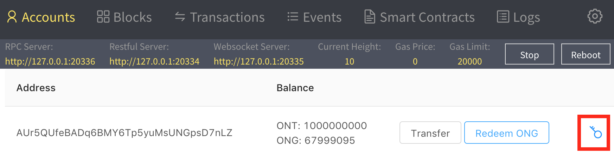
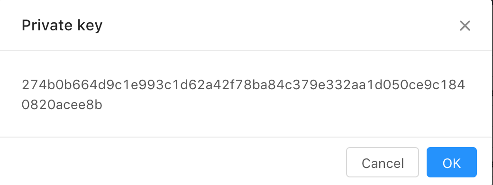
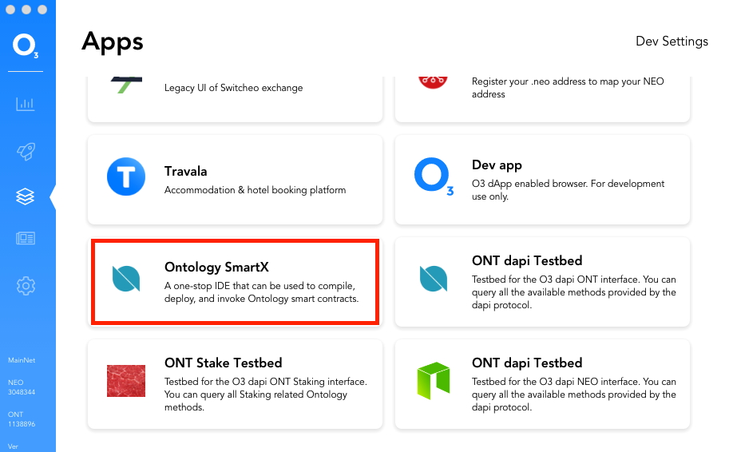
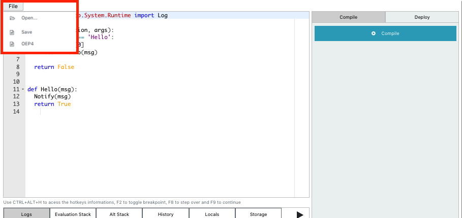
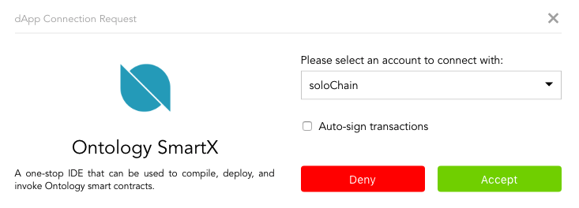
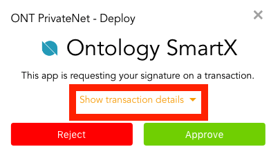
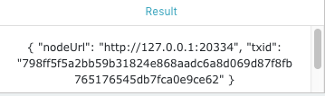
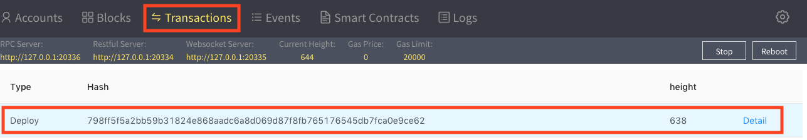
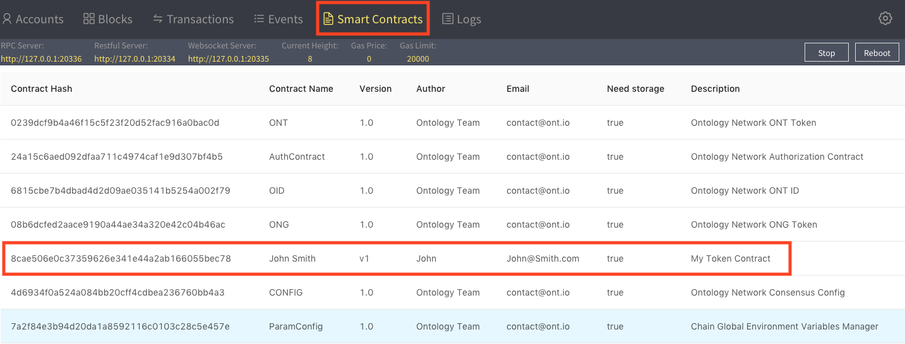
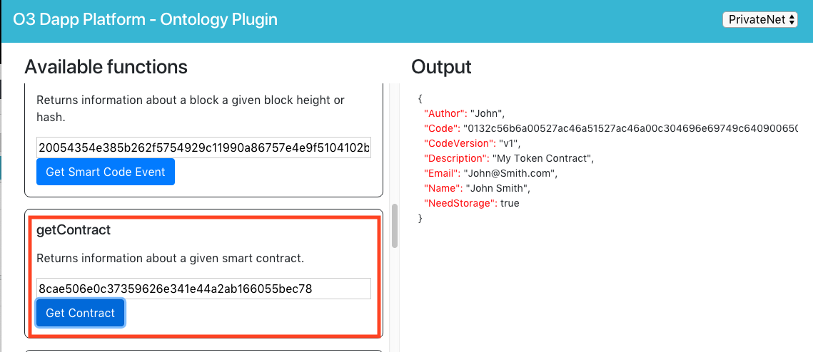

# Getting started
This is a walkthrough of how to get setup in order to start creating, deploying, and interacting with smart contracts on the Ontology Blockchain.

We will be using 3 separate tools during development:

##### Solo Chain
A self contained Ontology private network. No additional dependencies required.

##### O3
dAPI wallet provider which supports the Ontology interface

##### SmartX
Write and compile smart contract code. Available as an O3 dapp.

## Installation
Download and install the latest version of the latest versions of the Solo Chain and O3 apps.

[Solo Chain Installer](https://github.com/punicasuite/solo-chain/releases)

[O3 Desktop Installer](https://o3.network/)
Be sure to install the desktop version of the O3 application for development. Mobile support coming soon.

## Solo Chain setup

Open the Solo Chain app, and click start if not already started.

Claim your ONG for the master account.

Get the private key of the master account by clicking on the key, and copying the value.

Note that this account is for the private network only. Please do not use this account for any main net transaction, or ever share or display your real private key with anyone but yourself.

## O3 Setup

Open up the O3 app, and click the "Import existing wallet" button.

Paste the Solo Chain master account private key into the provided field.

Give the account a name, and a password to login to this account in the future.

You should now be logged into the Solo Chain master account in O3. Please navigate to the apps screen by clicking on the apps icon in the toolbar on the left hand side.

Once on the apps screen, click on the title "Apps" rapidly 10 times to put the O3 app into developer mode.

You should notice that in dev mode you will now have access to the "Dev Settings" menu on the top right, and the addition of several developer apps to the app list.

In the "Dev Settings" menu, you can set the location of your private Ontology network. By default, it should already be set up to work with your Solo Chain private network.

## Creating your Smart Contract

Open up the SmartX app from the list in the O3 application. Please be sure to open from within the O3 app, and NOT directly from your browser. The version provided in the O3 app list is customized to streamline your development experience using the O3 and Solo Chain apps.

Upon opening the app, you will be presented with the default hello world contract. Click on the "File" button on the top left to open up the menu, where you can open a contract file on your local machine, save the current smart contract to your local machine, or load a template, such as OEP4. For this example, go ahead and load up the OEP4 template.

Once loaded, you can review the code in the IDE, and make changes to properties such as the token name or supply. Once you are satisfied, click on "Compile" on the right hand side to compile the contract to into the format required for deployment.

## Deploying your Smart Contract

Once compiled, you should see your compiled contract code on the right hand side. To proceed to deployment, click on either the "Deploy" tab on the top, or the "Next" button on the bottom.

Fill in some information about your contract, and click "Deploy".

The O3 app will be brought to the foreground, and will prompt you to authorize the deployment transaction. First select your Solo Chain master account, and accept the connection from the SmartX dapp.

You can then review the transaction confirmation dialog for the deployment transaction you are about to sign. Click on "Show transaction details" to review the details of the transaction.

Here, you want to ensure that the transaction is being sent to the correct network (PrivateNet in this case), and all the deployment information. Once ready, click the "Approve" button to sign and broadcast the transaction.

Once approving, the transaction will be broadcast to your private net, and you will be returned to the SmartX window. From here, you can see the transaction id for your deploy, and can look for this value in Solo Chain.

In the Solo Chain app, under the "Transaction" tab, you should see your transaction id at the top of the list with the type "Deploy".

In the "Smart Contracts" tab, you should also now see your newly deployed contract in the list of contract.

Please take note of the "Contract Hash" value of your contract, and make sure that it matches the value provided in SmartX after compiling.

## Calling your Smart Contract

Now that your contract is deployed to your private net, we want to call it. When calling your contract in your dapp, you can use the O3 dapi with the Ontology plugin. To guide you in doing so, the O3 app in dev mode provides a app called "ONT dapi Testbed".

Once open, use the network selector to change the network to private net. This testbed allows you to use all of the methods provided by the O3 Ontology plugin in a simple GUI. So you can experiment with calling the different functions on the different networks.

For example, you scroll down to the "getContract" methods, paste in your contract hash for your newly deployed smart contract, and it will pull the details for your contract. You can experiment calling the details for different contracts on test net or main net.

To make a test call to your contract, scroll down to "invokeRead", paste in your contract hash into the "Script Hash" field. We will be calling the "decimals" operation, and clear out the "Arguments" field since this method takes no input arguments. Upon submitting, the ouput on the right hand side will show you the JSON response back from the private net, where the "Result" is "08". Which correctly indicates the 8 decimal places out new token has.

From here, you can play around with the different methods available in the testbed, and when you are ready to start integrating calls to your contract from your dapp, head on over to the O3 Ontology dapi plugin repo. There you can learn more about how to integrate the JS packages into your app, and look at the source code for this testbed as a reference.

[o3-dapi-ont](https://github.com/O3Labs/o3-dapi/tree/ont-docs/packages/ont)

[ONT dapi Testbed Reference dapp](https://github.com/O3Labs/o3-dapi/tree/ont-docs/packages/ont/test/base)
